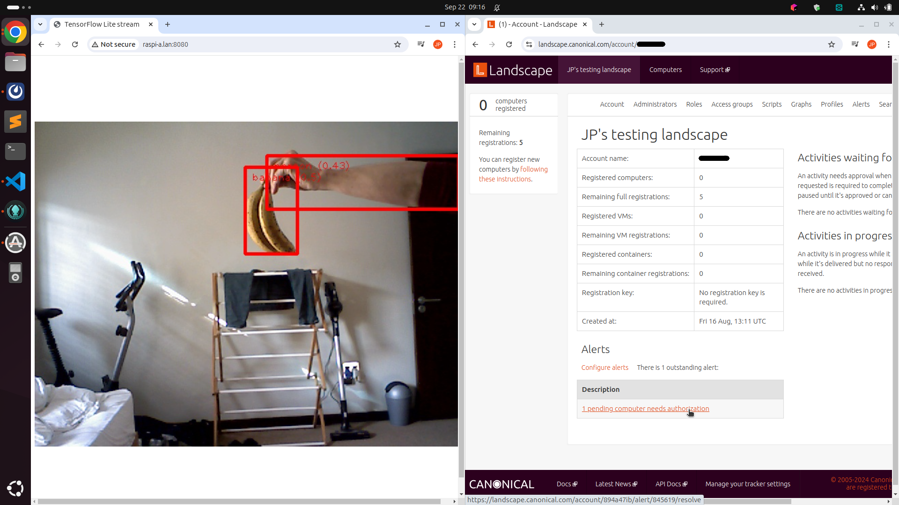
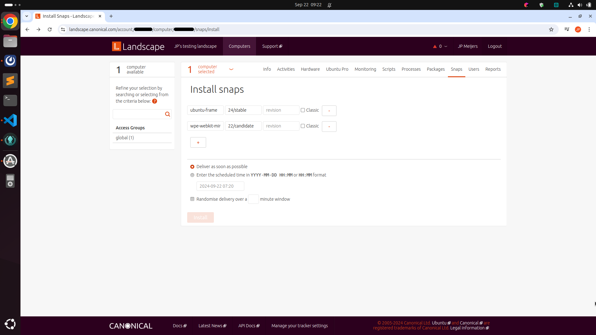
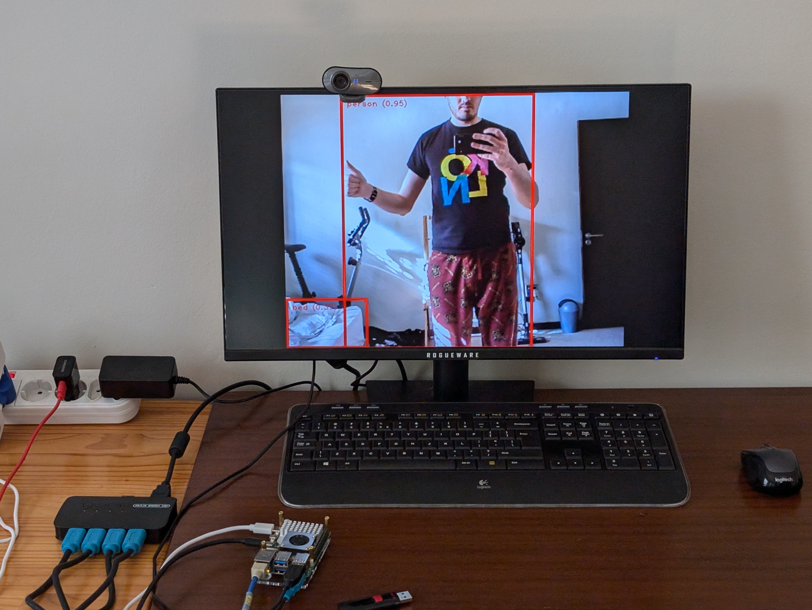

# Ubuntu Core custom image

This image includes the TensorFlow Lite example for Ubuntu Frame.
The snap is installed from the Snap Store.

By default `/dev/video0` is used, and it needs to be a `v4l` device.
A Raspberry Pi camera module will therefore not work.
Please use a USB webcam.
If the webcam is not mounted at `/dev/video0`, the path can be changed by setting snap options as documented [here](../ubuntu-frame/README.md#advanced-usage).

## Build the gadget snap

Apply these changes to [gadget.yaml](pi-gadget/gadget.yaml):

- Add the contents of [additions-to-gadget.yaml](additions-to-gadget.yaml) to the end.
- ~~Around line number 10, change the seed partition size from `1200M` to `1500M`.~~
- If you want to preconfigure WiFI, change the SSID and password.
- Add your Landscape account name if you want the device to automatically register as a pending device.

In [Makefile](pi-gadget/Makefile) on line 150 change `fkms` to `kms`.

Then build the gadget snap:

```
cd pi-gadget
snapcraft -v
```

## Create the image

The provided model includes all required snaps and dependencies for a Raspberry Pi to run the example and stream the annotated video to the network.

To view the annotated video on a local monitor, you will require the following snaps.
Including this in the model doesn't currently work, but can be installed after the initial startup via Landscape.

- `ubuntu-frame`
- `mesa-core22`
- `mesa-2404`
- `wpe-webkit-mir-kiosk`

Sign the model:

```
snap sign -k my-model-key model.json > model.model
```

Build the image:

```
ubuntu-image snap --snap pi-gadget/pi_24-1_arm64.snap --snap ../ubuntu-frame/tf-custom-examples_0.0.2_arm64.snap --validation=enforce model.model
```

## Booting the Pi

Flash the image onto an SD card.
Plug it into a Raspberry Pi, and power it up.
The Pi will restart a couple of times during the first boot while Ubuntu Core is configured and updated.
After the Pi has booted you should be able to go to it's IP address on port 8080 and see the output of the annotated camera feed.

## Landscape

If you configured Landscape, log into your account now.
You should see the device as a pending computer.
Accept the device onto your Landscape.



Wait until the computer info shows and then go to the **Snaps** tab.
Here you can click on **Install snaps**.
Enter snap name `ubuntu-frame` and `24/stable` for _tracking channnel_.
Clicvk **+** and also add `wpe-webkit-mir-kiosk` and `22/candidate`.
Click **install**.



The installation command will take some time to be delivered to the device, and then executed.
The result will be shown on Landscape.

If the installation was successful, you should see the annotated camera feed being displayed on the local display connected to the Raspberry Pi.



The URL that is displayed by the `wpe-webkit-mir-kiosk` is set to be the `tf-ubuntu-frame-example` endpoint by default, in the [gadget.yaml](additions-to-gadget.yaml).
This URL can be changed by setting snap options via a script on Landscape.
An example script to do this can be found [here](https://github.com/canonical/landscape-scripts/blob/main/core/snaps/update-snap-config.py).
